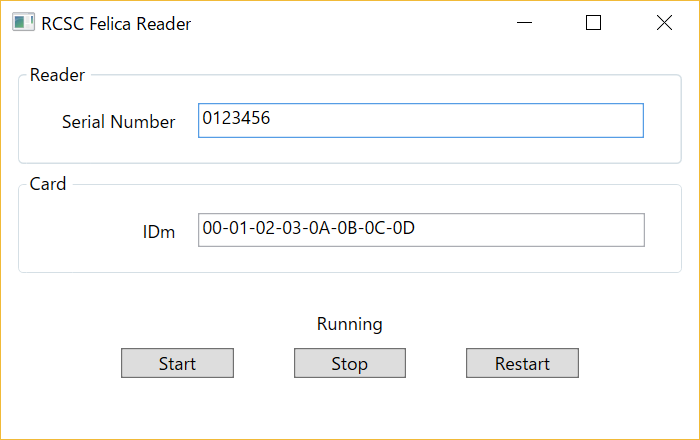

# PC/SC Felica Reader

カードリーダのシリアルナンバーと、FelicaのIDmを表示します。

It shows PaSoRi's serial number and Felica's IDm.

PC/SC の勉強のために作ったプロジェクトです。C++ の WinSCard API を利用しています。

I created it to lean PC/SC API. I used WinSCard API.

## 対象
以下のデバイスで動作テストしています

I've tested on these device.

* PaSoRi RC-S380
* Suica

## ドキュメント

スペックの詳細はSonyより提供されているドキュメントを参照してください。

Please see the document if you want to get more information.

SDK for NFC Starter Kit
https://www.sony.co.jp/Products/felica/business/products/ICS-D004.html

